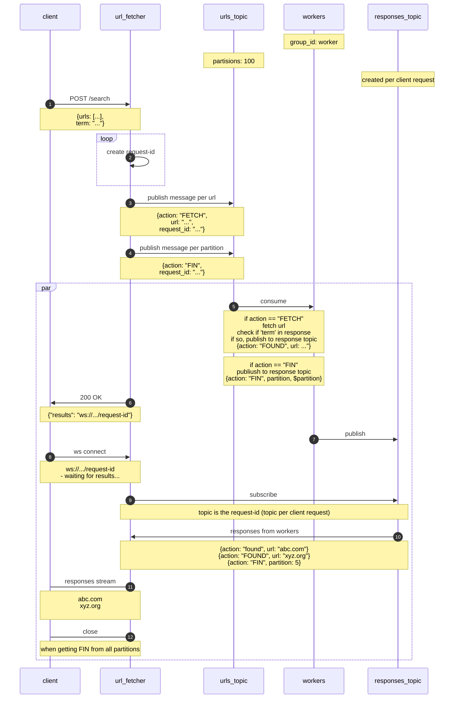

# system-designs

```mermaid
sequenceDiagram
    autonumber
    participant client
    participant url_fetcher
    participant urls_topic
    participant workers
    participant responses_topic
    note over workers: group_id: worker
    note over urls_topic: partisions: 100
    note over responses_topic: created per client request
    client->>url_fetcher: POST /search
    Note over client,url_fetcher: {urls: [...],<br/>term: "..."}

    loop 
        url_fetcher->>url_fetcher: create request-id
    end

    url_fetcher->>urls_topic: publish message per url
    Note over url_fetcher,urls_topic: {action: "FETCH",<br/>url: "...",<br/>request_id: "..."}
    url_fetcher->>urls_topic: publish message per partition
    Note over url_fetcher,urls_topic: {action: "FIN",<br/>request_id: "..."}

    par
        urls_topic->>workers: consume
        note over urls_topic,workers: if action == "FETCH"<br>fetch url<br/>check if 'term' in response<br/>if so, publish to response topic<br>{action: "FOUND", url: ..."}
        note over urls_topic,workers: if action == "FIN"<br>publiush  to response topic<br>{action: "FIN", partition, $partition}

        url_fetcher->>client: 200 OK
        Note over client,url_fetcher: {"results": "ws://.../request-id"}

        workers->>responses_topic: publish

        client->>url_fetcher: ws connect
        note over client,url_fetcher: ws://.../request-id<br/>- waiting for results...
        url_fetcher->>responses_topic: subscribe
        note over url_fetcher,responses_topic: topic is the request-id (topic per client request)
        responses_topic->>url_fetcher: responses from workers
        note over responses_topic,url_fetcher: {action: "found", url: "abc.com"}<br/>{action: "FOUND", url: "xyz.org"}<br/>{action: "FIN", partition: 5}
        url_fetcher->client: responses stream
        note over url_fetcher,client: abc.com<br/>xyz.org<br/>
        url_fetcher->client: close
        note over url_fetcher,client: when getting FIN from all partitions
    end
```
