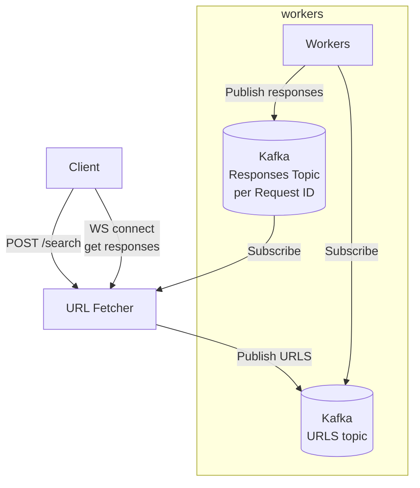

# urls fetcher

## problem

a user sends a single request that have
1. list of millions of urls
1. search term

the system needs to fetch said urls and return only those that their response bodies contain the seach term

## assumptions

* there are millions of urls
* there are small number of concurrent users
* the ratio between urls and urls that will match the search term is `log2` (so if we have 1,000,000 urls, we expect to have about 19 responses)


## design

1. client sends a POST request with urls and and a search term

```json
{
    "urls": [...],
    "term": "vova"
}
```

2. service creates a request id and publishes a message for each url to the URLs topic

```json
{
    "action": "FETCH",
    "url": "...",
    "term": "vova",
    "request_id": "b68d7aa6-3e2a-4adf-bd8b-1c4b09c9ca79"
}
```

3. then for each partition service publishes a `FIN` event so we know that for this request id, for this partition, we're done.


```json
{
    "action": "FIN",
    "request_id": "b68d7aa6-3e2a-4adf-bd8b-1c4b09c9ca79"
}
```

4. at this point, we know the request is stored (we're waiting for `ACK` when publinshing) so we can return a response to the client that it can start waitinf for results


```json
{
    "response-ws": "ws://host/responses/b68d7aa6-3e2a-4adf-bd8b-1c4b09c9ca79"
}
```

5. mean while workers taking `FETCH` tasks, download the url, check if it contains `term` and if so, publish an event to a topic which name is the `request_id`

```json
{
    "action": "RESULT",
    "url": "..."
}
```

6. if a worker sees a `FIN` message, it publishes that to the same topic, adding the partition id

```json
{
    "action": "FIN",
    "partition": n
}
```

7. meanwhile on the service side, a client connects to the websocket and the service subscribes to the topic indicated by the request id. because we're not expecting many results, we can always reply the topic from the begining everrytime user connects.
8. everytime we get a `RESULT` event, we forward that to the websocket
9. everytime we get a `FIN` event, we remove its `partition` from the `waiting` set
10. when `waiting` set is empty, it means all paritions are done, we can close the websocket


## block design


## sequence diagram


# why it works?

## quick kafka intro
* Kafka has `topics`, `partitions` and `consumer groups (group id)`
* `topic` can have multiple partitions
* messages in a `partition` are ordered
* if `topic` has multiple `partitions` messages will be ordered in same partition but not across the topic
* one `partition` can be consumed by consumer group at a time (so if you have 3 consumers, with same group id, but your topic has 1 partition, 2 consumers will idle)

## in the proposed solution

* *urls* topic has more paritions than workers (100 paritions)
* all workers have the same `group id` (this ensures same message won't get consumed by different workers)
* so if we have 10 workers, each will consume from 10 partitions, and per partitions order is preserved
* service gets request from client and generates a unique request id (`uuid`)
* the service publishing to the *urls* topic, after sending a message per url sends `FIN` message per partition (including the `partition_id`) - this ensures we have a way of knowing that for a given request_id, this partition is done.
* when worker gets a message, it will go and do the work and if it finds the `term` it will publish a message to a topic - topic name is the `request_id` that comes with the message
* when worker seems a `FIN` message it will publish it to the same `request_id` topic, but include the parittion number
* we need this to know that all work is done for a specific request
* mean while, after client sends the request to the service it gets back a `websocket` url, with the `request_id` it generated above
* when client connects with this websocket url, service uses the `request_id` to find the relevant topic and subscribes to it
* since we assume we won't get many results (if we have 1M urls, we expect to get about 20~ back) - it means we can just reply the whole topic every time user reconnects (we could optimize that by using offsets, but not sure it's needed)
* when we reply this topic, we keep an in memory set of `waiting` partition ids - initialized to `set(range(100))` (we know in advance number of partitions), every time we see a `FIN` message we remove its `partition_id` from the set
* when our in memory set is empty, we can close the websocket or send 'all done'.

# running containers

starting zookeeper
```bash
docker run --rm  --network app-tier --name zookeeper-server -e ALLOW_ANONYMOUS_LOGIN=yes bitnami/zookeeper:latest
```

starting kafka
```bash
docker run --name kafka-server --network app-tier -e ALLOW_PLAINTEXT_LISTENER=yes -e KAFKA_CFG_ZOOKEEPER_CONNECT=zookeeper-server:2181 bitnami/kafka:latest
```

creating a topic with many partitions
```bash
# docker exec into the kafka container and run this:

kafka-topics.sh --create --bootstrap-server localhost:9092 --replication-factor 1 --partitions 100 --topic urls-topic
```

starting app
```bash
docker run -p 8000:8000 --network app-tier  -it sd-app uvicorn server:app --app-dir src --host 0.0.0.0
```


# Running with RedPanda

## Run local redpanda 

```bash
rpk container start -n 3
rpk topic create urls-topic --brokers 127.0.0.1:49154,127.0.0.1:49161,127.0.0.1:49162 --partitions 100
```

copy the brokers list from the above step to the config


## running the server

```bash

virtualenv .pyenv
. .pyenv/bin/activate
pip instsall -r requirements.txt
uvicorn server:app --host 0.0.0.0 --port 8000
```

## curl

```bash
WS=`curl -X POST localhost:8000/urls --silent  | jq -r '.ws'` && wscat -c "ws://0.0.0.0:8000${WS}"
```
