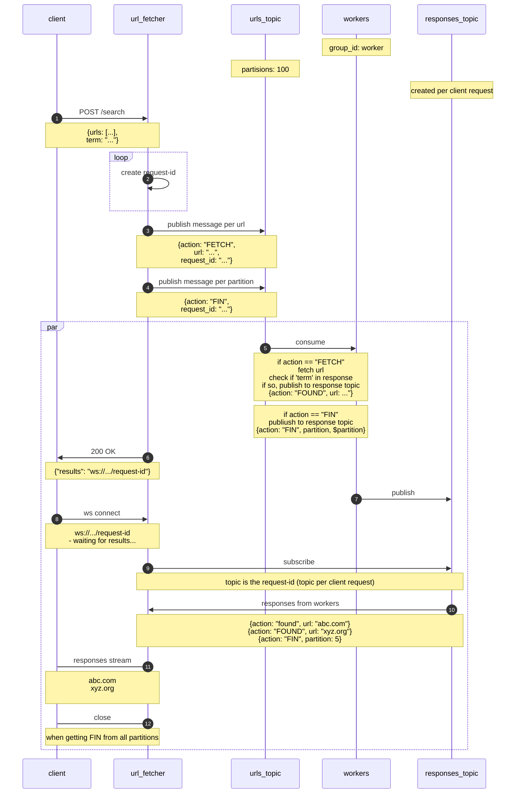

# urls fetcher

## problem

a user sends a single request that have
1. list of millions of urls
1. search term

the system needs to fetch said urls and return only those that their response bodies contain the seach term

## assumptions

* there are millions of urls
* there are small number of concurrent users
* the ratio between urls and urls that will match the search term is `log2`

## sequence diagram



# running containers

starting zookeeper
```bash
docker run --rm  --network app-tier --name zookeeper-server -e ALLOW_ANONYMOUS_LOGIN=yes bitnami/zookeeper:latest
```

starting kafka
```bash
docker run --name kafka-server --network app-tier -e ALLOW_PLAINTEXT_LISTENER=yes -e KAFKA_CFG_ZOOKEEPER_CONNECT=zookeeper-server:2181 bitnami/kafka:latest
```

creating a topic with many partitions
```bash
# docker exec into the kafka container and run this:

kafka-topics.sh --create --bootstrap-server localhost:9092 --replication-factor 1 --partitions 100 --topic urls-topic
```

starting app
```bash
docker run -p 8000:8000 --network app-tier  -it sd-app uvicorn server:app --app-dir src --host 0.0.0.0
```
